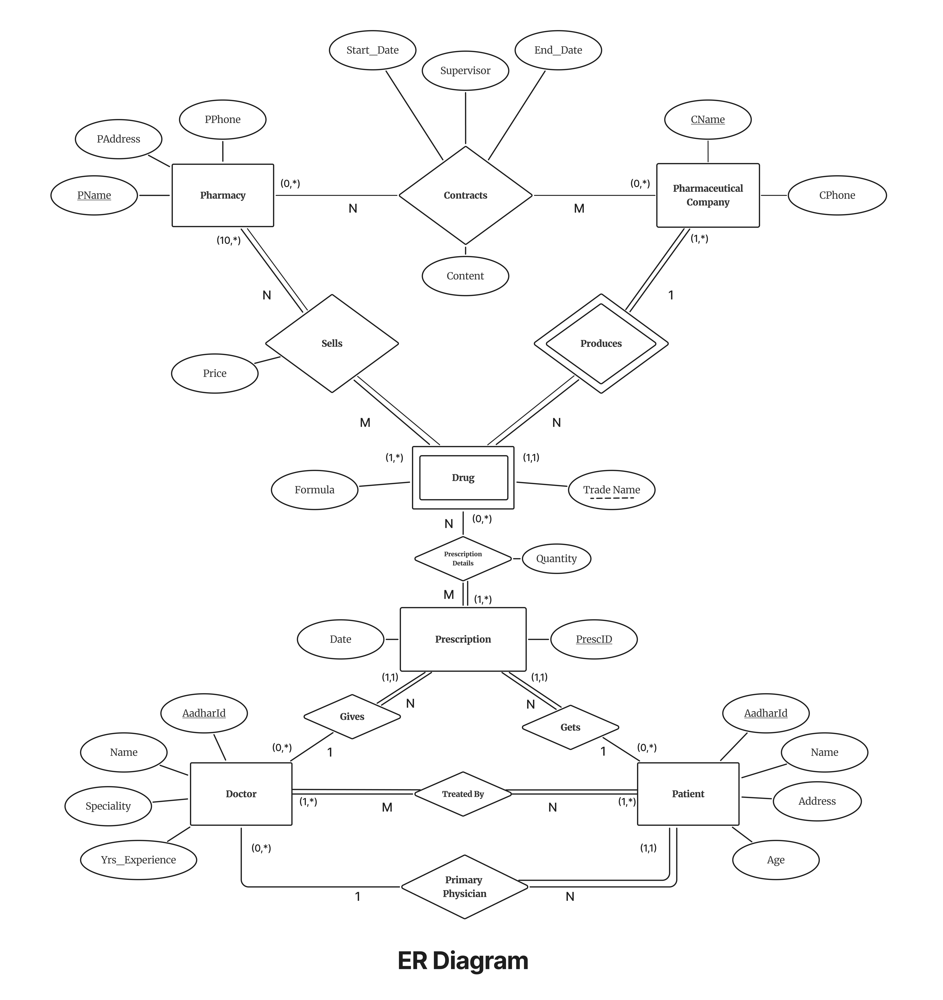
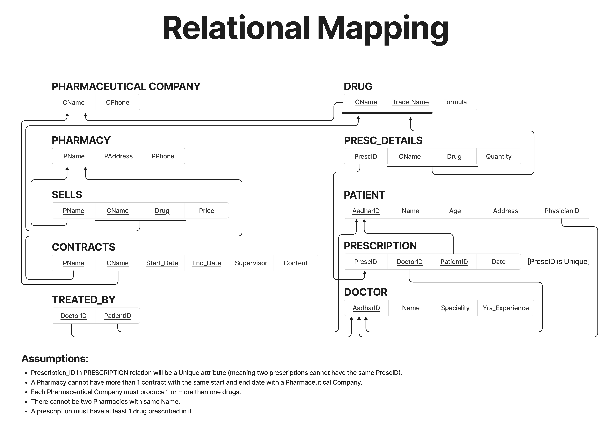

## Database Design for a Healthcare System

This project features a **normalized and relationally sound database system** designed for **NOVA**, a fictional pharmaceutical retail chain. The goal was to model, implement, and manage the core business operations of pharmacies, drug manufacturers, patients, doctors, and prescriptions using **Oracle SQL and PL/SQL**.

### 🕹️ Design Highlights

- Designed in **Third Normal Form (3NF)** to eliminate redundancy, maintain data consistency, and ensure referential integrity across all entities. The design rigorously enforces normalization principles to streamline data storage and simplify query logic.
  
- Built with a comprehensive schema comprising **11 interconnected relations**, representing the full scope of business entities and their interactions within a healthcare/pharmaceutical ecosystem:
  - Core entities: `PHARMACY`, `DOCTOR`, `PATIENT`, `DRUG`, `PHARMACEUTICAL_COMPANY`
  - Transactional and relational tables: `PRESCRIPTION`, `PRESC_DETAILS`, `SELLS`, `CONTRACTS`, `TREATED_BY`

- Optimized implementation with **20+ stored operations**, carefully structured using:
  - `PL/SQL Procedures` for modular and reusable logic
  - `Functions` to encapsulate query logic and return calculated results
  - `Cursors` to iterate over and process result sets dynamically
  - `Triggers` to enforce business rules such as:
    - Unique prescription per patient per date
    - Minimum drug inventory per pharmacy
    - Automatic integrity checks on contract overlaps and supervisor assignments

- Extensive use of **constraints and validation** at both schema and programmatic levels, including:
  - `PRIMARY KEY`, `FOREIGN KEY`, and `UNIQUE` constraints
  - Domain validation with `CHECK` constraints
  - Logic-based enforcement via triggers and conditional procedures

- Designed to **scale and query efficiently across 500+ rows** of realistic, dummy dataset entries — simulating real-world use cases in patient care, prescription tracking, and pharmaceutical logistics.

- Modular design enables future extensibility (e.g., user roles, GUI integration, audit logging) while maintaining clean separation of concerns and adherence to relational database best practices.

---

### 🗺️ Schema Snapshots

### ER Diagram  

### Relational Mapping  

---

### 🗝️ Key Functionalities Supported
- Add, update, and delete: **Doctors**, **Patients**, **Drugs**, **Prescriptions**, **Contracts**
- Generate:
  - Prescription reports by patient and date
  - Drug inventory per pharmacy
  - Contract details between pharmacy & pharma companies
  - Patient list for a given doctor
- Validate:
  - One prescription per patient per date
  - Unique `PrescID`, consistent foreign keys, and quantity constraints
- Enforced through:
  - **Primary / Foreign Keys**
  - **CHECK / UNIQUE constraints**
  - **Triggers** for critical business rules

---

> 📍 *The system was designed with command-line demonstration in mind and does not rely on a graphical interface, ensuring full SQL/PLSQL interaction fidelity.*

---

## Contributors
<table>
  <tr>
    <td align="center">
      <a href="https://github.com/UMAANG-DEVANG-KHAMBHATI">
        
         <b>Umaang Khambhati</b>
      </a>
    </td>
    <td align="center">
      <a href="https://github.com/Aayush394">
        
         <b>Aayush Shah</b>
      </a>
    </td>
    <td align="center">
      <a href="https://github.com/anant1184">
        
         <b>Anant Gupta</b>
      </a>
    </td>
  </tr>
</table>
